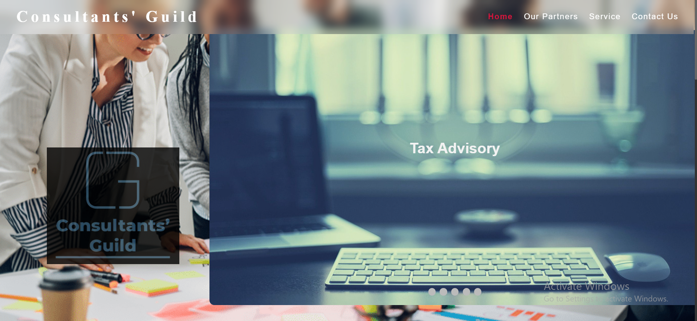

# Consultants' Guild Website

A responsive website for a consultancy business, "Consultants' Guild," built with HTML, CSS, and JavaScript. The site features a slideshow, team profiles, service descriptions, and a contact form, showcasing skills in front-end development and UI/UX design.

## Features
- **Dynamic Slideshow**: Auto-rotating slideshow with captions for services like Tax Advisory and IT Services.
- **Responsive Navigation**: Sticky header with mobile-friendly menu toggle.
- **Team Profiles**: Partner section with detailed bios (images placeholder-ready).
- **Service Cards**: Flexbox-based cards detailing consultancy services.
- **Contact Form**: Functional form with contact details and icons.
- **Smooth Animations**: Fade effects for slideshow and scroll-triggered section transitions.

## Screenshots



## Tech Stack
- **HTML5**: Semantic structure for sections and form.
- **CSS3**: Flexbox, media queries, and animations for responsive design.
- **JavaScript**: Slideshow functionality and navigation interactivity.
- **Assets**: Local images for logos/icons and external images for backgrounds.

## Setup
1. Clone the repository:
   ```bash
   git clone https://github.com/Portfolio-Profile/consultants-guild-website.git
